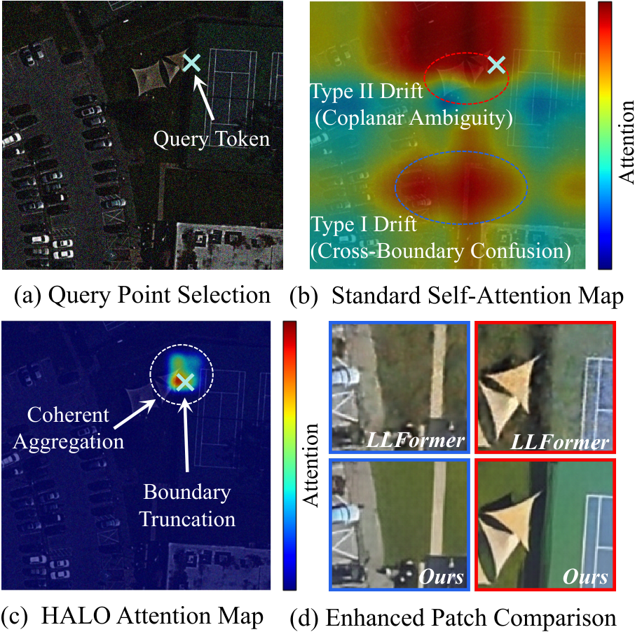
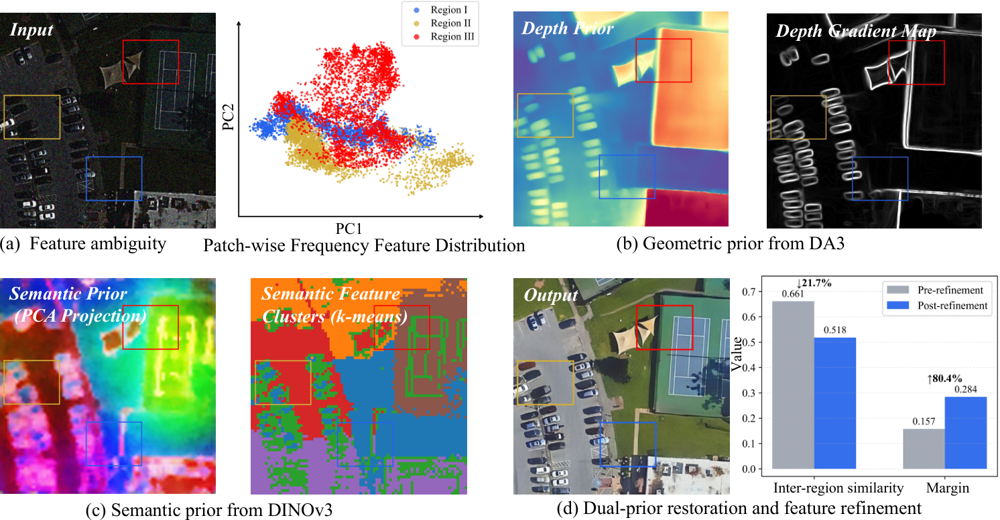
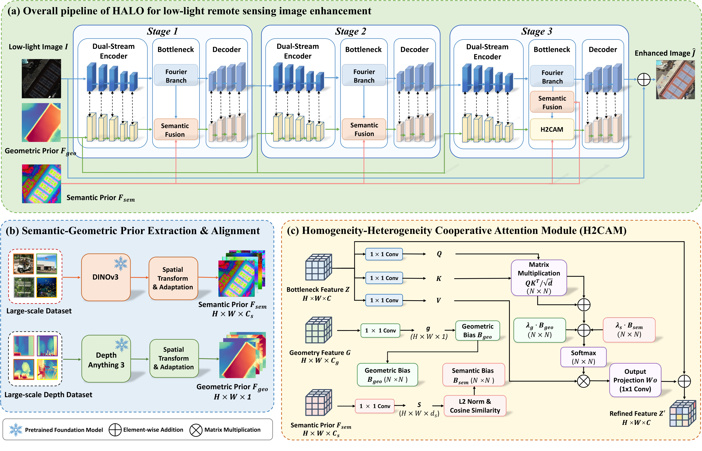
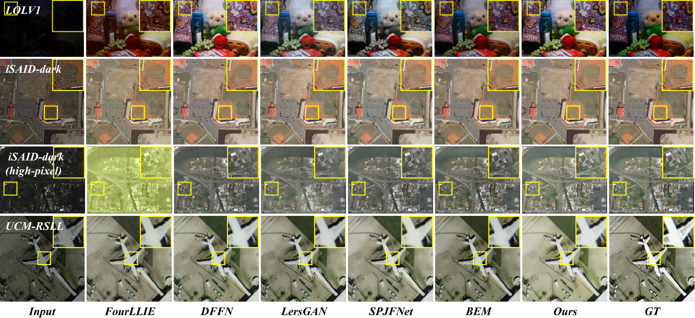
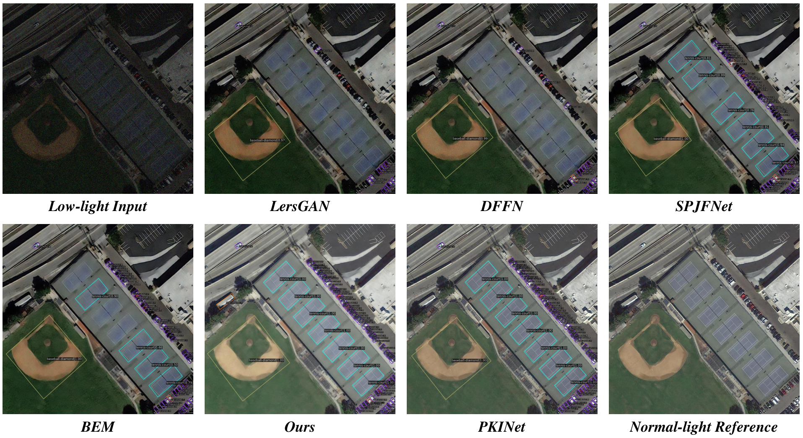

# HALO

### Overcoming Attention Drift: Homogeneity-Heterogeneity Guided Feature Aggregation for Low-Light Remote Sensing Image Enhancement

[](LICENSE)
[](https://github.com/AlexYangxx/HALO)

Official PyTorch implementation of **HALO** — a dual-prior-driven framework for low-light remote sensing image enhancement, submitted to *IEEE Transactions on Geoscience and Remote Sensing (TGRS)*.

> **HALO** = **H**omogeneity **A**nd boundary heterogeneity for **LO**w-light remote sensing image enhancement

**Authors:** [Xingxing Yang](https://scholar.google.com/citations?user=0y5m7O8AAAAJ&hl=zh-CN), Yaozi Zhong, Shaohui Mei, Mingyang Ma

---

## Abstract

Restoring high-fidelity remote sensing imagery from extreme low-light degradation is indispensable for reliable Earth observation and downstream machine vision. Under severe noise and illumination corruption, existing methods suffer from **attention drift** — erroneously aggregating features across distinct physical boundaries and causing structural blurring and spectral distortion.

HALO formulates restoration as a **guided feature aggregation** problem driven by foundation-model priors:

- An **illumination-invariant semantic prior** (DINOv3) provides *regional homogeneity* as a **positive bias** for content-consistent aggregation.
- A **pseudo-3D topological prior** (Depth Anything 3) provides *boundary heterogeneity* as a **negative penalty** to prevent cross-boundary confusion.

These priors are integrated through the **Homogeneity-Heterogeneity Cooperative Attention Module (H2CAM)** at the network bottleneck, translating external physical constraints into explicit attention-level biases rather than passive feature concatenation.

---

## Motivation: Attention Drift

Under extreme low-light degradation, unconstrained self-attention is dominated by noise and non-uniform illumination rather than the underlying clear signal. We formalize this failure as **Attention Drift**, which manifests in two forms:

| Type | Name | Symptom |
|------|------|---------|
| **Type I** | Cross-boundary Confusion | Spurious high-frequency noise causes physically disjoint tokens to aggregate, blurring structural truncations |
| **Type II** | Coplanar Ambiguity | Distinct materials collapse into similar dark responses; continuous homogeneous regions fragment |

<p align="center">
  
  &nbsp;&nbsp;
  
</p>

<p align="center"><em>Left: Attention drift visualization (Type I & II). Right: Dual priors reduce erroneous similarity by <b>21.7%</b> and boost the discriminative margin by <b>80.4%</b>.</em></p>

---

## Framework Overview

HALO adopts a **three-stage cascaded encoder–decoder** backbone. Semantic and geometric priors are extracted offline via **DINOv3** and **Depth Anything 3**, aligned to the restoration feature space, and injected at each bottleneck. The final stage employs **H2CAM** to enforce deterministic prior-guided aggregation.

<p align="center">
  
</p>

<p align="center"><em>HALO framework. (a) Cascaded dual-stream restoration. (b) Offline prior extraction via DINOv3 &amp; DA3. (c) H2CAM integrates priors as deterministic attention biases.</em></p>

### H2CAM: Prior-Guided Deterministic Aggregation

Standard attention: `A = Softmax(QKᵀ / √d)`

HALO augments affinity with dual physical constraints:

```
 = Softmax( QKᵀ/√d + λₛ·B_sem − λ_g·B_geo ) · V
```

| Bias | Prior | Role |
|------|-------|------|
| **B_sem** (positive) | DINOv3 semantic affinity | Encourages aggregation within semantically homogeneous regions |
| **B_geo** (negative) | DA3 depth discontinuity | Penalizes aggregation across topological boundaries |

### Code ↔ Paper Mapping

| Paper | Code (`net/`) | CLI flag |
|-------|---------------|----------|
| H2CAM | `WindowedDPCAA` (`dp_caa.py`) | `--use_dp_caa true` |
| Semantic prior fusion | `SemanticBottleneckFusion` (`prior_fusion.py`) | `--use_dinov3 true` |
| Geometric prior guidance | `DepthGuidedCAMixerSR` (`DGMixer.py`) | depth maps (always used) |
| Fourier bottleneck branch | `FreqResidualStack` (`freq_blocks.py`) | `--use_freq_branch true` |
| Full network | `MST_Plus_Plus` (`depth_mst_3.py`) | — |

---

## Main Results

### Quantitative Comparison (PSNR ↑ / SSIM ↑ / LPIPS ↓)

| Method | iSAID-dark | iSAID-dark (hi-res) | UCM-RSLL | LOLv1 |
|--------|:----------:|:-------------------:|:--------:|:-----:|
| DFFN (TGRS'24) | 25.541 / 0.785 / 0.217 | 23.325 / 0.725 / 0.286 | 19.864 / 0.747 / 0.236 | 23.462 / 0.832 / 0.128 |
| CIDNet (CVPR'25) | 24.975 / 0.786 / 0.194 | 23.671 / 0.681 / 0.335 | 19.990 / 0.740 / 0.227 | 23.808 / 0.857 / 0.086 |
| BEM_MC (AAAI'26) | 25.826 / 0.802 / 0.185 | 21.876 / 0.744 / 0.259 | 19.378 / 0.722 / 0.252 | 23.070 / 0.851 / 0.089 |
| **HALO (Ours)** | **26.527 / 0.812 / 0.170** | **25.476 / 0.770 / 0.211** | **21.893 / 0.787 / 0.217** | **24.129 / 0.851 / 0.094** |

### Ablation on iSAID-dark

| Setting | Geo. | Sem. | H2CAM | PSNR | SSIM | LPIPS |
|---------|:----:|:----:|:-----:|:----:|:----:|:-----:|
| Baseline | ✗ | ✗ | ✗ | 24.255 | 0.763 | 0.240 |
| Geo-guided | ✓ | ✗ | ✗ | 25.971 | 0.799 | 0.223 |
| Sem-guided | ✗ | ✓ | ✗ | 25.442 | 0.775 | 0.192 |
| Dual-prior (naïve) | ✓ | ✓ | ✗ | 25.315 | 0.784 | 0.226 |
| **Full model** | ✓ | ✓ | ✓ | **26.527** | **0.812** | **0.170** |

Naïvely concatenating both priors without H2CAM causes **feature assimilation** (PSNR drops to 25.315 dB). H2CAM elevates priors from auxiliary inputs to hard physical constraints.

### Visual Comparison

<p align="center">
  
</p>

<p align="center"><em>Visual comparisons on LOLv1, iSAID-dark, iSAID-dark (high-pixel), and UCM-RSLL. HALO restores clearer structures and more natural illumination while suppressing color distortion.</em></p>

### Downstream Object Detection (Low-light DOTA-v1.0)

Enhanced images are fed into a pre-trained **PKINet** detector without fine-tuning:

| Method | F1 ↑ | mAP@0.5 ↑ |
|--------|:----:|:---------:|
| Clean (upper bound) | 0.913 | 0.870 |
| LersGAN | 0.611 | 0.533 |
| DFFN | 0.635 | 0.546 |
| BEM | 0.719 | 0.640 |
| **HALO (Ours)** | **0.790** | **0.732** |

<p align="center">
  
</p>

---

## Project Structure

```
HALO/
├── train.py                  # Training entry point
├── eval.py                   # General evaluation (LOL, SICE, unpaired, …)
├── eval_isaid_metrics.py     # iSAID-dark evaluation (PSNR/SSIM/LPIPS/ΔE00)
├── depth_estimation.py       # DA3 depth backend
├── scripts/
│   ├── prepare_depth.py      # Batch-generate depth priors (DA3)
│   └── cache_dinov3_features.py  # Batch-cache DINOv3 features
├── net/
│   ├── depth_mst_3.py        # MST_Plus_Plus (HALO backbone)
│   ├── DGMixer.py            # Depth-guided CAMixer (geometric prior)
│   ├── prior_fusion.py       # Semantic prior fusion
│   ├── dp_caa.py             # H2CAM (WindowedDPCAA)
│   └── freq_blocks.py        # Frequency residual branch
├── assets/figures/           # Paper figures for documentation
├── Depth-Anything-3/         # Vendored DA3 (pip install -e)
├── dinov3-main/              # Vendored DINOv3 (pip install -e)
└── data_dir/                 # Datasets (not tracked by git)
```

---

## Installation

```bash
git clone https://github.com/AlexYangxx/HALO.git
cd HALO

conda create -n halo python=3.10 -y && conda activate halo

pip install torch torchvision torchaudio --index-url https://download.pytorch.org/whl/cu124
pip install -e ./dinov3-main
pip install -e ./Depth-Anything-3
pip install -r requirements.txt
```

| Model | Path | Notes |
|-------|------|-------|
| DINOv3 ViT-L/16 | `weights_dinov3/dinov3_vitl16_pretrain_lvd1689m-8aa4cbdd.pth` | Semantic prior extraction |
| DA3MONO-LARGE | HuggingFace `depth-anything/DA3MONO-LARGE` | Auto-downloaded on first run |

---

## Data Preparation

Depth maps (`low_depth/depth_maps/<stem>_depth.npz`) are **required** before training.

### iSAID-dark

```
data_dir/iSAID-dark/
├── train/{low, gt, low_depth/depth_maps/}
└── val/{low, gt, low_depth/depth_maps/}
```

### LOL-v1

```
data_dir/LOL-v1/
├── our485/{low, high, low_depth/depth_maps/}
└── eval15/{low, high, low_depth/depth_maps/}
```

---

## Prior Generation

```bash
# Depth prior (DA3) — required
python scripts/prepare_depth.py --dataset isaid --skip-high-depth
python scripts/prepare_depth.py --dataset lol --root data_dir/LOL-v1 --skip-high-depth

# Semantic prior (DINOv3) — required for H2CAM / semantic fusion
python scripts/cache_dinov3_features.py \
  --hub_local ./dinov3-main \
  --weights ./weights_dinov3/dinov3_vitl16_pretrain_lvd1689m-8aa4cbdd.pth \
  --model dinov3_vitl16 \
  --input_dir ./data_dir/iSAID-dark/train/low \
  --output_dir ./cache_dinov3/iSAID_train \
  --resize_mode short_side --img_size 224 --device cuda:0
```

More examples: [`DA3与DINOv3.md`](DA3%E4%B8%8EDINOv3.md)

---

## Training

### Full HALO (recommended)

```bash
python train.py \
  --dataset isaid_dark \
  --batchSize 8 --cropSize 256 --nEpochs 500 \
  --use_freq_branch true \
  --use_dinov3 true \
  --dinov3_cache_dir cache_dinov3/iSAID_train \
  --dinov3_cache_dir_val cache_dinov3/iSAID_val \
  --dinov3_sem_channels 1024 \
  --semantic_fusion_weight 0.1 --sem_warmup_epochs 8 \
  --use_dp_caa true \
  --val_folder exp/HALO/isaid_full/
```

### Key flags

| Flag | Default | Description |
|------|---------|-------------|
| `--use_freq_branch` | `true` | Fourier bottleneck residual |
| `--use_dinov3` | `false` | DINOv3 semantic prior |
| `--use_dp_caa` | `false` | H2CAM module |
| `--resume_path` | — | Resume from checkpoint |

**Loss:** L1 (λ=6) + SSIM (λ=0.5) + Edge (λ=50) + VGG perceptual (λ=0.01) + optional depth-edge consistency.

---

## Evaluation

```bash
python eval_isaid_metrics.py \
  --ckpt exp/HALO/isaid_full/isaid_dark_weights/training/epoch_485.pth \
  --low_dir data_dir/iSAID-dark/val/low \
  --gt_dir data_dir/iSAID-dark/val/gt \
  --output_dir eval_out/isaid_val \
  --report_txt eval_out/isaid_val/metrics.txt \
  --use_freq_branch true --use_dinov3 true \
  --dinov3_cache_dir cache_dinov3/iSAID_val \
  --use_dp_caa true
```

> Architecture flags must match the trained checkpoint.

---

## Acknowledgements

- [Depth Anything 3](https://github.com/ByteDance-Seed/Depth-Anything-3) — geometric / topological prior
- [DINOv3](https://github.com/facebookresearch/dinov3) — semantic prior
- [DFFN](https://github.com/) / [CIDNet](https://github.com/Fediory/CIDNet) — spatial-frequency restoration lineage

---

## License

Released under the [MIT License](LICENSE).

---

## Citation

If you find HALO useful, please cite:

```bibtex
@article{yang2026halo,
  title   = {Overcoming Attention Drift: Homogeneity-Heterogeneity Guided Feature Aggregation for Low-Light Remote Sensing Image Enhancement},
  author  = {Yang, Xingxing and Zhong, Yaozi and Mei, Shaohui and Ma, Mingyang},
  journal = {IEEE Transactions on Geoscience and Remote Sensing},
  year    = {2026}
}
```
