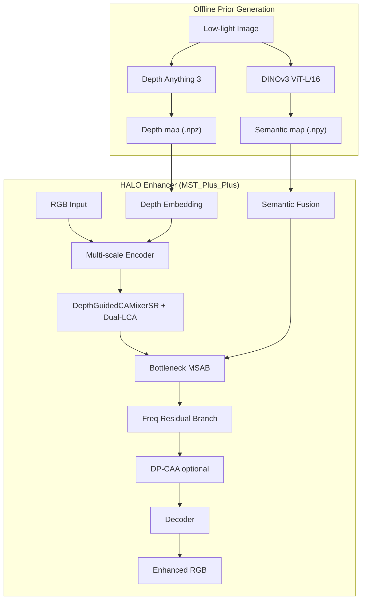

# HALO

**H**ierarchical **A**ggregation with **L**ow-light priors from **O**ffline foundation models

A dual-prior-driven framework for **low-light remote sensing image enhancement**. HALO formulates enhancement as a **guided feature aggregation** problem: a lightweight enhancer (`MST_Plus_Plus`) is steered by two offline foundation-model priors — **Depth Anything 3 (DA3)** for geometric structure and **DINOv3** for semantic context.

> Official repository: [AlexYangxx/HALO](https://github.com/AlexYangxx/HALO)

---

## Highlights

- **Dual-prior guidance** — depth maps from [Depth Anything 3](https://github.com/ByteDance-Seed/Depth-Anything-3) and semantic tokens from [DINOv3](https://github.com/facebookresearch/dinov3) are pre-computed offline and injected at training / inference time (no online FM forward pass).
- **Depth-guided multi-scale fusion** — `DepthGuidedCAMixerSR` and dynamic cross-modal gating fuse RGB features with purified depth features at every encoder stage.
- **Modular bottleneck enhancements** — three optional stages can be enabled independently:
  - **Stage A** — frequency residual branch (FFT amplitude / phase modulation)
  - **Stage B** — DINOv3 semantic bottleneck fusion with warmup
  - **Stage C** — windowed **D**ual-**P**rior **C**ontext-**A**ware **A**ttention (DP-CAA)
- **Remote sensing ready** — first-class support for **iSAID-dark** low-light aerial imagery, alongside LOL-v1 benchmarks.

---

## Architecture



**Core network** (`net/depth_mst_3.py` → `MST_Plus_Plus`):

| Module | Role |
|--------|------|
| `DepthGuidedCAMixerSR` | Depth-purified features gate RGB features via channel + spatial mixed gating (`net/DGMixer.py`) |
| `FreqResidualStack` | Lightweight FFT-domain residual at the bottleneck (`net/freq_blocks.py`) |
| `SemanticBottleneckFusion` | Projects cached DINOv3 tokens and fuses them with bottleneck features (`net/prior_fusion.py`) |
| `WindowedDPCAA` | Local window attention biased by semantic affinity and depth geometry (`net/dp_caa.py`) |

---

## Project Structure

```
HALO/
├── train.py                  # Training entry point
├── eval.py                   # General evaluation (LOL, SICE, unpaired, …)
├── eval_isaid_metrics.py     # iSAID-dark evaluation with PSNR/SSIM/LPIPS/ΔE00
├── depth_estimation.py       # DA3 depth backend used by prepare_depth.py
├── scripts/
│   ├── prepare_depth.py      # Batch-generate depth priors (DA3)
│   └── cache_dinov3_features.py  # Batch-cache DINOv3 patch features
├── net/
│   ├── depth_mst_3.py        # MST_Plus_Plus (main model)
│   ├── DGMixer.py            # Depth-guided CAMixer blocks
│   ├── prior_fusion.py       # Semantic prior fusion
│   ├── dp_caa.py             # Dual-prior context-aware attention
│   └── freq_blocks.py        # Frequency residual branch
├── data/                     # Datasets, loaders, training options
├── loss/                     # L1, SSIM, edge, perceptual, depth-consistency losses
├── Depth-Anything-3/         # Vendored DA3 source (install with pip -e)
├── dinov3-main/              # Vendored DINOv3 source (install with pip -e)
└── data_dir/                 # Place datasets here (not tracked by git)
```

---

## Installation

### Requirements

- Python ≥ 3.10
- CUDA-capable GPU (recommended)
- PyTorch with CUDA (tested with cu124)

### Step-by-step

```bash
# 1. Clone
git clone https://github.com/AlexYangxx/HALO.git
cd HALO

# 2. Create environment
conda create -n halo python=3.10 -y
conda activate halo

# 3. Install PyTorch (adjust CUDA version as needed)
pip install torch torchvision torchaudio --index-url https://download.pytorch.org/whl/cu124

# 4. Install vendored foundation-model packages
pip install -e ./dinov3-main
pip install -e ./Depth-Anything-3

# 5. Install remaining dependencies
pip install -r requirements.txt
```

### Foundation-model weights (download separately)

| Model | Suggested path | Notes |
|-------|----------------|-------|
| DINOv3 ViT-L/16 | `weights_dinov3/dinov3_vitl16_pretrain_lvd1689m-8aa4cbdd.pth` | Used by `cache_dinov3_features.py` |
| DA3MONO-LARGE | HuggingFace `depth-anything/DA3MONO-LARGE` | Auto-downloaded on first `prepare_depth.py` run |

> Weight files and datasets are excluded from git via `.gitignore`. Download them before training.

---

## Data Preparation

All datasets live under `data_dir/`. Depth maps must exist before training — the dataloader reads `low_depth/depth_maps/<stem>_depth.npz` alongside each low-light image.

### LOL-v1

```
data_dir/
└── LOL-v1/                  # or symlink our485/ → here
    ├── our485/
    │   ├── low/
    │   ├── high/
    │   └── low_depth/depth_maps/   # generated by prepare_depth.py
    └── eval15/
        ├── low/
        ├── high/
        └── low_depth/depth_maps/
```

Training default: `--data_train_lol_v1 data_dir/our485` (set to `data_dir/LOL-v1/our485` if using the layout above).

### iSAID-dark (remote sensing)

```
data_dir/
└── iSAID-dark/
    ├── train/
    │   ├── low/
    │   ├── gt/
    │   └── low_depth/depth_maps/
    └── val/
        ├── low/
        ├── gt/
        └── low_depth/depth_maps/
```

---

## Prior Generation

### 1. Depth prior (DA3) — required

```bash
# iSAID-dark
python scripts/prepare_depth.py --dataset isaid --skip-high-depth

# LOL-v1
python scripts/prepare_depth.py --dataset lol --root data_dir/LOL-v1 --skip-high-depth
```

This calls `depth_estimation.generate_depth_map` with `DA3MONO-LARGE` and writes one `.npz` per image at native resolution.

### 2. Semantic prior (DINOv3) — optional, for Stage B / DP-CAA

```bash
python scripts/cache_dinov3_features.py \
  --hub_local ./dinov3-main \
  --weights ./weights_dinov3/dinov3_vitl16_pretrain_lvd1689m-8aa4cbdd.pth \
  --model dinov3_vitl16 \
  --input_dir ./data_dir/iSAID-dark/train/low \
  --output_dir ./cache_dinov3/iSAID_train \
  --resize_mode short_side \
  --img_size 224 \
  --device cuda:0
```

Repeat for validation / test splits. Each image produces a `.npy` file with shape `[C, H', W']` (C = 1024 for ViT-L/16).

See [`DA3与DINOv3.md`](DA3%E4%B8%8EDINOv3.md) for more command examples.

---

## Training

### Baseline (depth prior + frequency branch)

```bash
python train.py \
  --dataset isaid_dark \
  --batchSize 8 \
  --cropSize 256 \
  --nEpochs 500 \
  --use_freq_branch true \
  --val_folder exp/HALO/isaid_baseline/
```

### Full dual-prior (depth + DINOv3 + DP-CAA)

```bash
python train.py \
  --dataset isaid_dark \
  --use_freq_branch true \
  --use_dinov3 true \
  --dinov3_cache_dir cache_dinov3/iSAID_train \
  --dinov3_cache_dir_val cache_dinov3/iSAID_val \
  --dinov3_sem_channels 1024 \
  --semantic_fusion_weight 0.1 \
  --sem_warmup_epochs 8 \
  --use_dp_caa true \
  --val_folder exp/HALO/isaid_dual_prior/
```

### LOL-v1 example

```bash
python train.py \
  --dataset lol_v1 \
  --data_train_lol_v1 data_dir/LOL-v1/our485 \
  --data_val_lol_v1 data_dir/LOL-v1/eval15/low \
  --data_valgt_lol_v1 data_dir/LOL-v1/eval15/high \
  --use_freq_branch true \
  --val_folder exp/HALO/lol_v1/
```

### Key training options

| Flag | Default | Description |
|------|---------|-------------|
| `--dataset` | `lol_v1` | `lol_v1` or `isaid_dark` |
| `--use_freq_branch` | `true` | Enable Stage A frequency residual |
| `--use_dinov3` | `false` | Enable Stage B semantic fusion |
| `--use_dp_caa` | `false` | Enable Stage C dual-prior attention |
| `--resume_path` | — | Resume from full checkpoint or weights-only `.pth` |
| `--val_folder` | `exp/SGDF-Net/` | Experiment output root (weights, logs, val images) |

Checkpoints are saved under `{val_folder}/{dataset}_weights/training/`.

**Loss composition:** L1 + SSIM + edge + VGG perceptual, with optional depth-edge consistency (`--depth_edge_weight`).

---

## Evaluation

### iSAID-dark (recommended)

```bash
python eval_isaid_metrics.py \
  --ckpt exp/HALO/isaid_dual_prior/isaid_dark_weights/training/epoch_485.pth \
  --low_dir data_dir/iSAID-dark/val/low \
  --gt_dir data_dir/iSAID-dark/val/gt \
  --output_dir eval_out/isaid_val \
  --report_txt eval_out/isaid_val/metrics.txt \
  --use_freq_branch true \
  --use_dinov3 true \
  --dinov3_cache_dir cache_dinov3/iSAID_val \
  --use_dp_caa true
```

Reports **PSNR**, **SSIM**, **LPIPS (Alex)**, **MAE**, and **ΔE00**.

### LOL-v1

```bash
python eval.py --lol \
  --use_freq_branch true \
  --use_dinov3 true \
  --dinov3_cache_dir cache_dinov3/LOLv1_vitl16/val
```

> Architecture flags (`--use_freq_branch`, `--use_dinov3`, `--use_dp_caa`, …) **must match** the checkpoint used at training time.

---

## Training Pipeline Overview

```
┌─────────────────┐     ┌──────────────────┐     ┌─────────────────┐
│  Raw dataset    │────▶│ prepare_depth.py │────▶│  depth .npz     │
│  (low / gt)     │     │  (DA3 offline)   │     │  per image      │
└─────────────────┘     └──────────────────┘     └────────┬────────┘
                                                          │
┌─────────────────┐     ┌──────────────────┐              │
│  Low images     │────▶│ cache_dinov3_    │────▶ semantic│
│                 │     │ features.py      │     .npy      │
└─────────────────┘     └──────────────────┘              │
                                                          ▼
                                               ┌──────────────────┐
                                               │     train.py     │
                                               │  MST_Plus_Plus   │
                                               └────────┬─────────┘
                                                          ▼
                                               ┌──────────────────┐
                                               │ eval.py /        │
                                               │ eval_isaid_      │
                                               │ metrics.py       │
                                               └──────────────────┘
```

---

## Acknowledgements

This project builds upon and vendors the following open-source works:

- [Depth Anything 3](https://github.com/ByteDance-Seed/Depth-Anything-3) — monocular depth estimation prior
- [DINOv3](https://github.com/facebookresearch/dinov3) — self-supervised visual representation prior
- [CIDNet](https://github.com/Fediory/CIDNet) lineage — HVI color space and training utilities

---

## License

This project is released under the [MIT License](LICENSE).

---

## Citation

If you find HALO useful in your research, please cite:

```bibtex
@article{yang2026halo,
  title   = {HALO: Dual-Prior-Guided Feature Aggregation for Low-Light Remote Sensing Image Enhancement},
  author  = {Yang, Xingxing and others},
  journal = {IEEE Transactions on Geoscience and Remote Sensing},
  year    = {2026}
}
```

*(Update with the final bibliographic information upon publication.)*
